# 👁️ VisionAssist AI

<div align="center">

## Gesture-Controlled Agentic Personal Assistant


**Control your computer using hand gestures, voice commands, and AI — completely hands-free.**

*A modern desktop AI assistant that combines Computer Vision, Speech Recognition, and Agentic AI to automate real-world desktop tasks.*

🚧 **Project Status:** Actively under development. New features and improvements are being added regularly.

</div>

---

# 📖 Overview

VisionAssist AI is an AI-powered desktop assistant that enables users to interact with their computer using **hand gestures** and **voice commands**. It combines **Computer Vision**, **Speech Recognition**, **Large Language Models**, and **Agentic AI** to automate desktop tasks through a natural and intuitive interface.

The assistant can recognize hand gestures in real time, listen to voice commands, understand user intent using **Google Gemini** and **LangGraph**, and perform tasks such as launching applications, managing files, searching the web, reading PDF documents, and responding with synthesized speech.

The goal of VisionAssist AI is to provide a seamless hands-free desktop experience while showcasing the integration of modern AI technologies into a practical real-world application.

---

# 📑 Table of Contents

- [✨ Features](#-features)
- [📸 Screenshots](#-screenshots)
- [🛠️ Tech Stack](#️-tech-stack)
- [📁 Project Structure](#-project-structure)
- [🖐️ Gesture Controls](#️-gesture-controls)
- [🚀 Getting Started](#-getting-started)
- [🔮 Future Enhancements](#-future-enhancements)
- [👩‍💻 Author](#-author)
- [📄 License](#-license)

---

# ✨ Features

## 🤖 AI Assistant

- Intelligent conversational assistant powered by Google Gemini.
- Agentic workflow using LangGraph.
- Natural language understanding.
- Real-time task execution.
- Voice-enabled interaction.

---

## 🖐️ Gesture Recognition

Control the assistant without touching the keyboard or mouse.

Supported gestures:

- ✋ Open Palm → Activate Assistant
- ☝️ Index Finger → Start Listening
- 👍 Thumbs Up → Confirm / Execute Command
- 👎 Thumbs Down → Listen Again
- ✊ Fist → Deactivate Assistant

---

## 🎤 Voice Interaction

- Speech-to-Text
- Text-to-Speech
- Hands-free command execution
- Natural language conversations

---

## 📄 Document Assistant

- Upload PDF documents
- Extract text
- AI-powered document understanding

---

## 🔍 OCR Support

- Extract text from images
- Read scanned documents
- OCR-based text recognition

---

## 💻 Desktop Automation

Current supported actions include:

- Open VS Code
- Open File Explorer
- Open Downloads
- Open Documents
- Open Google
- Open GitHub
- Search YouTube
- Search the Web

---

## 📂 File Management

Manage files using natural language:

- Create folders
- Delete folders
- Create files
- Delete files

---

## 📊 Dashboard

Monitor:

- Assistant Status
- Current Gesture
- Voice State
- AI Responses
- System Activity

---

# 📸 Screenshots

Explore the interface and major functionalities of **VisionAssist AI**.

---

## 🏠 Landing Page (Dark Theme)

The modern dark-themed landing page introduces VisionAssist AI and provides quick access to the assistant.

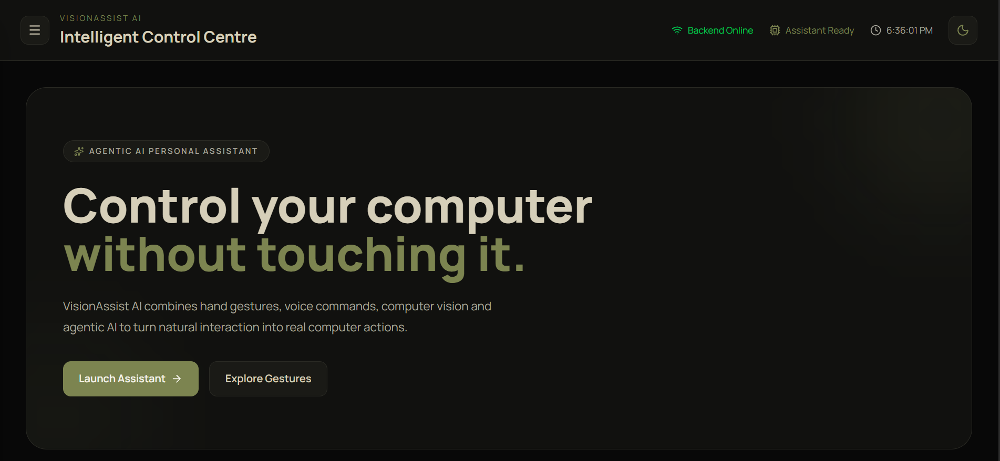

---

## ☀️ Landing Page (Light Theme)

A clean and minimal light theme for users who prefer a brighter interface.

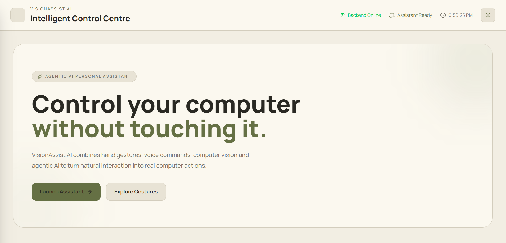

---

## 📊 Home Dashboard

The dashboard provides an overview of the assistant and serves as the central hub for interacting with different features.

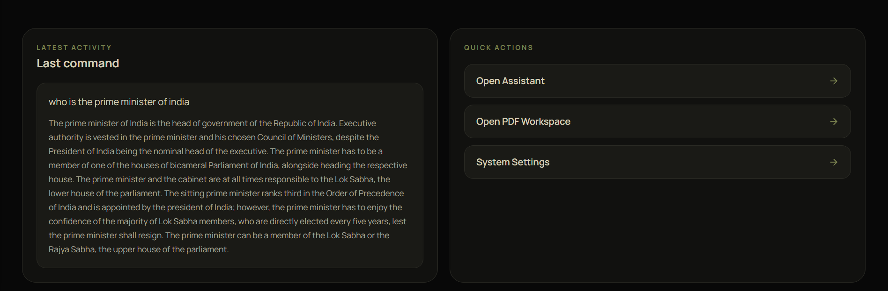

---

## 🤖 Assistant – Active State

The assistant is activated and ready to receive commands.

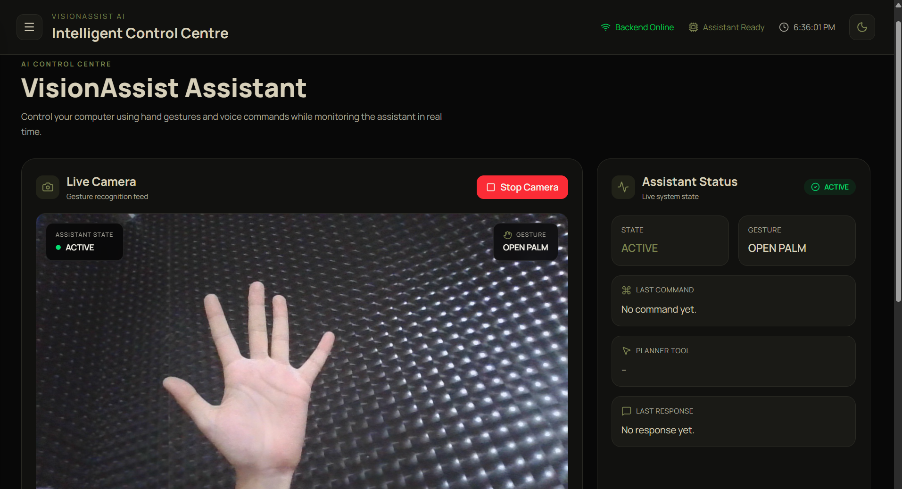

---

## 🎤 Assistant – Listening State

After the listening gesture is detected, the assistant begins processing voice commands.

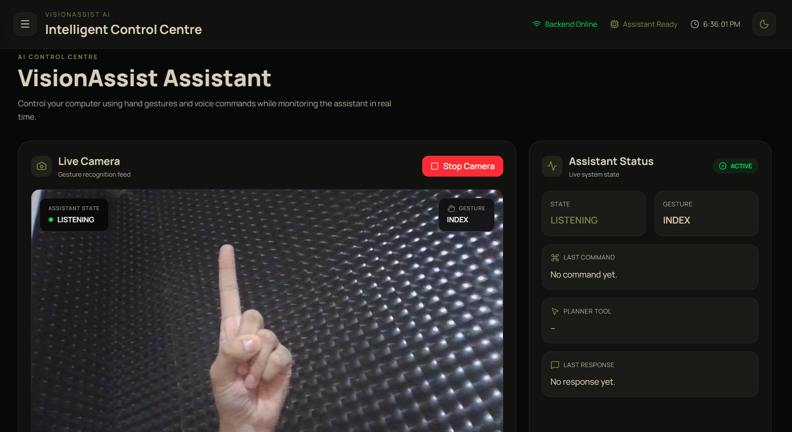

---

## ⏸️ Assistant – Inactive State

The assistant remains idle until activated again.

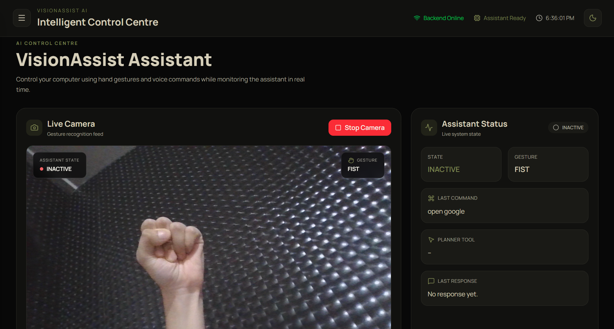

---

## 👍 Gesture Recognition – Thumbs Up

Thumbs Up is used to confirm and execute the recognized command.

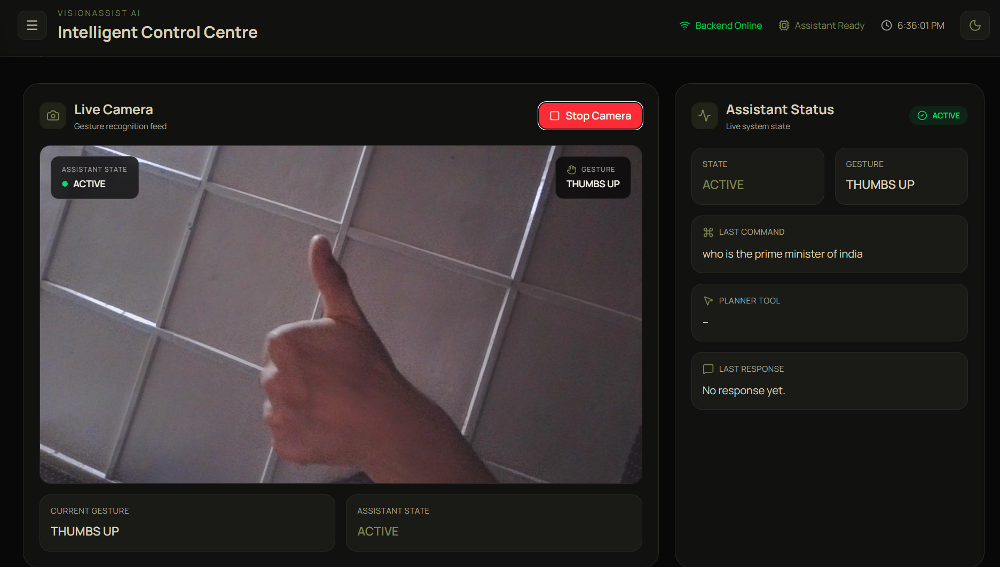

---

## 👎 Gesture Recognition – Thumbs Down

Thumbs Down allows the assistant to discard the previous input and listen again.

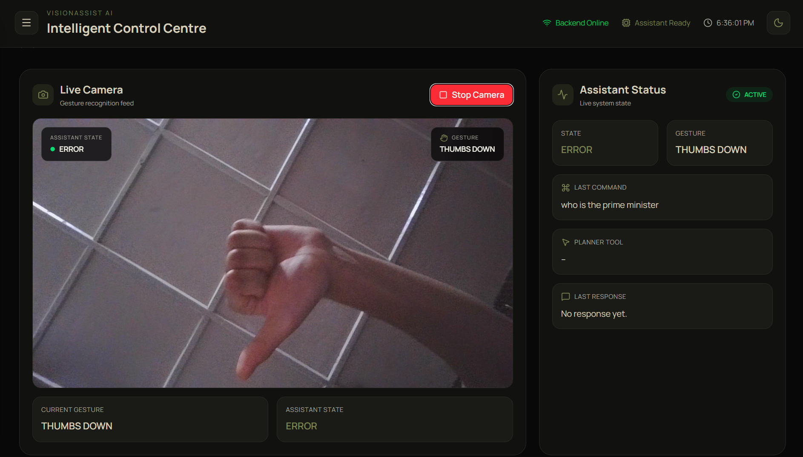

---

## 📄 PDF Upload

Upload PDF documents for AI-powered reading and analysis.

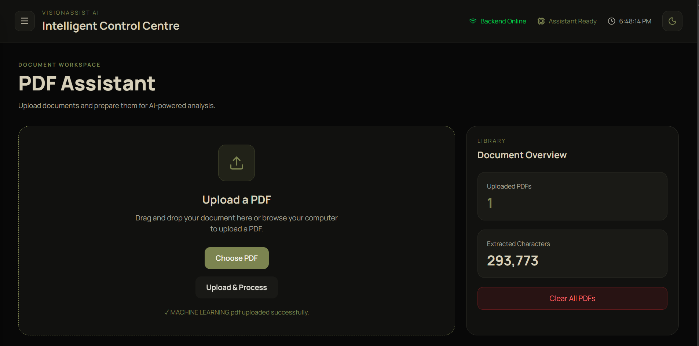

---

## 📑 PDF Text Extraction

Extracted text from uploaded PDF documents is displayed for further interaction with the AI assistant.

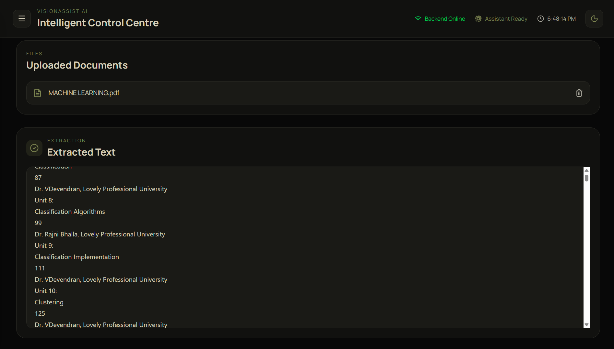

---

## 📈 Assistant Dashboard

Monitor assistant status, recent activities, and system information in real time.

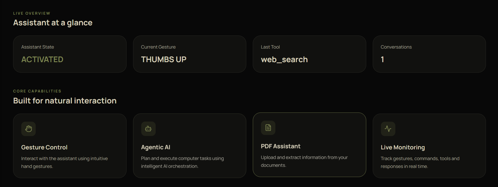

---

## 📁 Sidebar Navigation

Quick navigation between different sections of the application.

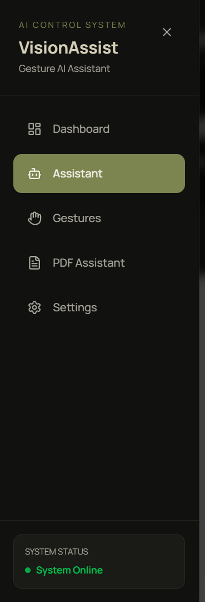

---

## ⚙️ Settings

Configure application preferences and customize the assistant experience.

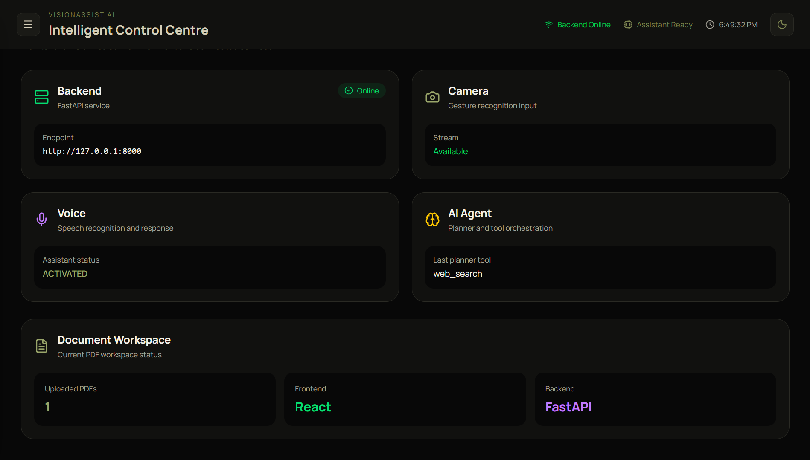

---

## 💬 AI Response

The assistant generates intelligent responses using Google Gemini and displays them within the chat interface.

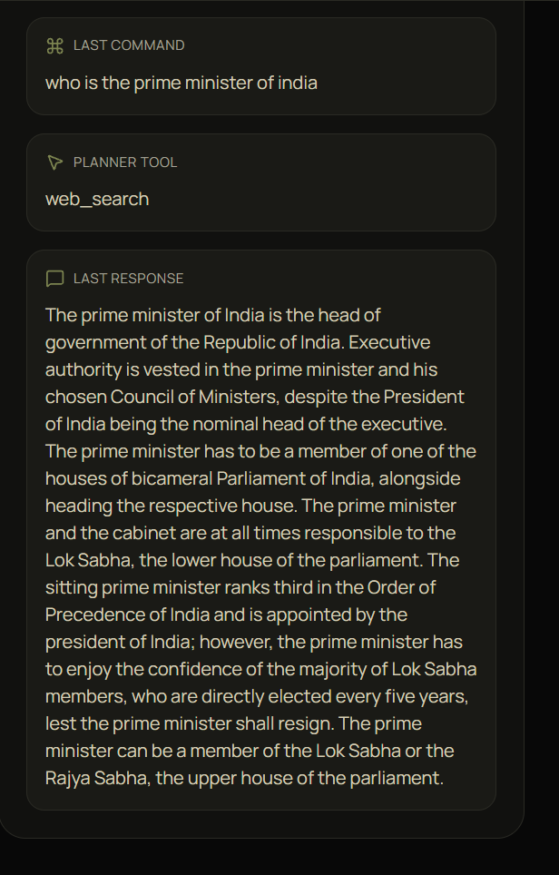

---
# 🛠️ Tech Stack

## Frontend

| Technology | Purpose |
|------------|----------|
| React (Vite) | User Interface |
| Tailwind CSS | Responsive Styling |
| JavaScript | Frontend Logic |

---

## Backend

| Technology | Purpose |
|------------|----------|
| FastAPI | REST API Backend |
| Python | Backend Development |

---

## Artificial Intelligence

| Technology | Purpose |
|------------|----------|
| Google Gemini API | Large Language Model |
| LangGraph | Agentic AI Workflow |

---

## Computer Vision

| Technology | Purpose |
|------------|----------|
| OpenCV | Camera Processing |
| MediaPipe Hands | Hand Gesture Recognition |

---

## Speech Processing

| Technology | Purpose |
|------------|----------|
| SpeechRecognition | Speech-to-Text |
| pyttsx3 | Text-to-Speech |

---

## Document Processing

| Technology | Purpose |
|------------|----------|
| PyMuPDF (fitz) | PDF Reading |
| OCR | Text Extraction from Images |

---

# 📁 Project Structure

```text
VisionAssist-AI
│
├── assets/
│   └── screenshots/
│
├── backend/
│   ├── app/
│   │   ├── agents/
│   │   ├── gestures/
│   │   ├── prompts/
│   │   ├── routers/
│   │   ├── services/
│   │   ├── speech/
│   │   ├── tools/
│   │   └── main.py
│   │
│   └── requirements.txt
│
├── frontend/
│   ├── src/
│   │   ├── components/
│   │   ├── pages/
│   │   ├── assets/
│   │   ├── App.jsx
│   │   └── main.jsx
│   │
│   ├── package.json
│   └── vite.config.js
│
└── README.md
```

---

# 🖐️ Gesture Controls

| Gesture | Action |
|----------|--------|
| ✋ Open Palm | Activate VisionAssist AI |
| ☝️ Index Finger | Start Listening |
| 👍 Thumbs Up | Confirm and Execute Command |
| 👎 Thumbs Down | Listen Again |
| ✊ Fist | Deactivate Assistant |

---

# 🚀 Getting Started

## 1️⃣ Clone the Repository

```bash
git clone https://github.com/srishtisharma07/VisionAssist-AI.git
```

Move into the project directory.

```bash
cd VisionAssist-AI
```

---

## 2️⃣ Backend Setup

Navigate to the backend folder.

```bash
cd backend
```

Create a virtual environment.

```bash
python -m venv venv
```

Activate the environment.

### Windows

```bash
venv\Scripts\activate
```

### Linux / macOS

```bash
source venv/bin/activate
```

Install the required packages.

```bash
pip install -r requirements.txt
```

Run the FastAPI server.

```bash
uvicorn app.main:app --reload
```

The backend will start on:

```text
http://127.0.0.1:8000
```

---

## 3️⃣ Frontend Setup

Open another terminal.

```bash
cd frontend
```

Install dependencies.

```bash
npm install
```

Start the development server.

```bash
npm run dev
```

The frontend will start on:

```text
http://localhost:5173
```

---

## 📦 Required Python Packages

The backend uses the following major libraries:

- FastAPI
- Uvicorn
- LangGraph
- Google Generative AI
- OpenCV
- MediaPipe
- SpeechRecognition
- pyttsx3
- PyMuPDF (fitz)

---

## 🔑 Environment Variables

Create a `.env` file inside the **backend** directory.

```env
GOOGLE_API_KEY=YOUR_GEMINI_API_KEY
```

---

# 🔮 Future Enhancements

VisionAssist AI is actively under development. Planned improvements include:

- 🚀 Improve hand gesture recognition accuracy.
- 🌍 Add multilingual voice interaction.
- 🤖 Expand the AI assistant with additional desktop automation capabilities.
- 📄 Enhance PDF understanding and document analysis.
- 🔍 Improve OCR accuracy for scanned documents and images.
- 🎨 Refine the user interface and overall user experience.
- ☁️ Add cloud deployment support.
- 🖥️ Extend compatibility across different operating systems.
- ⚡ Improve overall performance and responsiveness.

---

# 🤝 Contributing

Contributions are welcome!

If you'd like to improve VisionAssist AI:

1. Fork the repository.
2. Create a new feature branch.

```bash
git checkout -b feature/your-feature-name
```

3. Commit your changes.

```bash
git commit -m "Add your feature"
```

4. Push the branch.

```bash
git push origin feature/your-feature-name
```

5. Open a Pull Request.

Every contribution, whether it's fixing bugs, improving documentation, or adding new features, is appreciated.

---

# 👩‍💻 Author

## Srishti Sharma

**B.Tech Computer Science Engineering**

**Minor in Artificial Intelligence & Machine Learning**

Passionate about building intelligent AI-powered applications using Computer Vision, Agentic AI, and Full-Stack Development.

GitHub: [@srishtisharma07](https://github.com/srishtisharma07)

---

# ⭐ Support

If you found this project helpful, please consider giving it a **⭐ Star** on GitHub.

Your support motivates future development and helps others discover the project.

If you have suggestions or feedback, feel free to open an issue or submit a pull request.

---

# 📄 License

This project is intended for **educational and learning purposes**.

---

# 🙏 Acknowledgements

Special thanks to the developers and communities behind these amazing open-source technologies:

- React
- FastAPI
- Google Gemini
- LangGraph
- OpenCV
- MediaPipe
- Tailwind CSS
- PyMuPDF

These tools made the development of VisionAssist AI possible.

---

<div align="center">

# 👁️ VisionAssist AI

### Gesture-Controlled Agentic Personal Assistant

**Hands-Free • Intelligent • Agentic**

Built with ❤️ by **Srishti Sharma**

⭐ **If you like this project, don't forget to star the repository!**

</div>


---
